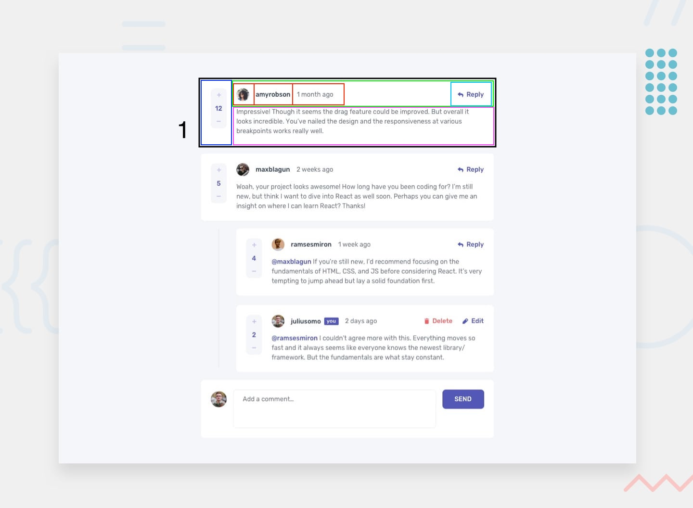

# Frontend Mentor - Interactive comments section

Your users should be able to:

- View the optimal layout for the app depending on their device's screen size
- See hover states for all interactive elements on the page
- Create, Read, Update, and Delete comments and replies
- Upvote and downvote comments
- **Bonus**: If you're building a purely front-end project, use `localStorage` to save the current state in the browser that persists when the browser is refreshed.
- **Bonus**: Instead of using the `createdAt` strings from the `data.json` file, try using timestamps and dynamically track the time since the comment or reply was posted.

### Expected behaviour

- First-level comments should be ordered by their score, whereas nested replies are ordered by time added.
- Replying to a comment adds the new reply to the bottom of the nested replies within that comment.
- A confirmation modal should pop up before a comment or reply is deleted.
- Adding a new comment or reply uses the `currentUser` object from within the `data.json` file.
- You can only edit or delete your own comments and replies.
